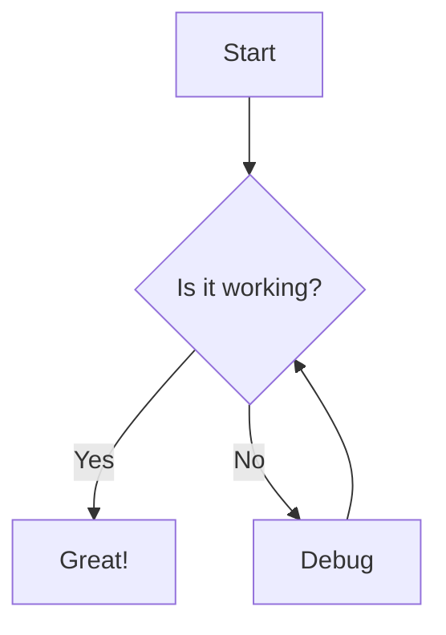
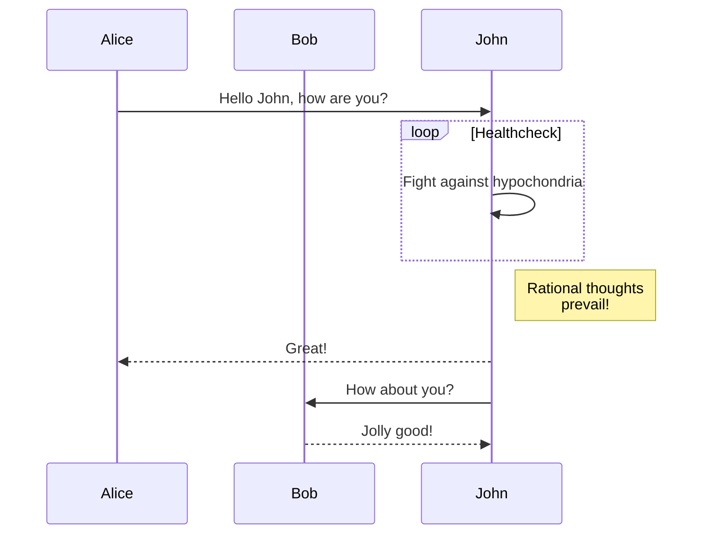
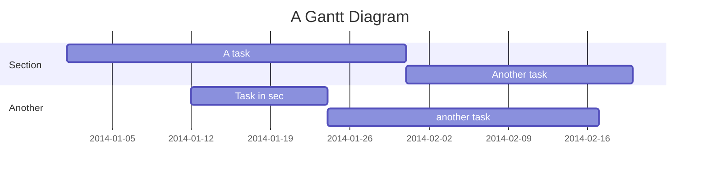
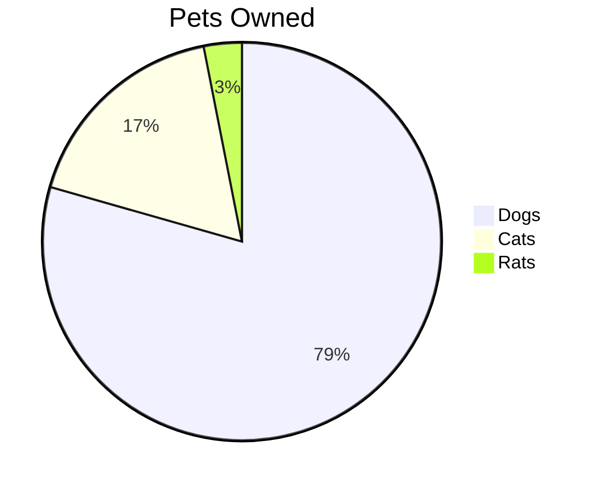

This file contains examples of standard Markdown syntax along with extended features like Mermaid diagrams and KaTeX mathematical expressions.

## Basic Markdown Syntax

### Headers

# Header 1
## Header 2
### Header 3
#### Header 4
##### Header 5
###### Header 6

Alternative Headers:

Header 1
=========

Header 2
---------

### Emphasis

*This text is italicized*

_This text is also italicized_

**This text is bold**

__This text is also bold__

***This text is bold and italicized***

___This text is also bold and italicized___

~~This text is strikethrough~~

### Lists

#### Unordered Lists

* Item 1
* Item 2
  * Subitem 2.1
  * Subitem 2.2
* Item 3

- Item 1
- Item 2
  - Subitem 2.1
  - Subitem 2.2
- Item 3

+ Item 1
+ Item 2
  + Subitem 2.1
  + Subitem 2.2
+ Item 3

#### Ordered Lists

1. First item
2. Second item
3. Third item
   1. Subitem 3.1
   2. Subitem 3.2
4. Fourth item

#### Task Lists

- [x] Completed task
- [ ] Incomplete task
- [x] Another completed task
- [ ] Another incomplete task

### Links

[Basic link](https://www.example.com)

[Link with title](https://www.example.com "Example Website")

<https://www.example.com> (Automatic link)

### Images


### Blockquotes

> This is a blockquote
>
> > This is a nested blockquote
>
> Back to the first level

### Code

Inline code: `var example = "hello world";`

```
Code block without syntax highlighting
function test() {
  console.log("notice the blank line before this function?");
}
```

```javascript
// Code block with syntax highlighting
function test() {
  console.log("syntax highlighting for JavaScript");
}
```

### Horizontal Rule

---

***

___

### Tables

| Header 1 | Header 2 | Header 3 |
|----------|----------|----------|
| Cell 1   | Cell 2   | Cell 3   |
| Cell 4   | Cell 5   | Cell 6   |

| Left-aligned | Center-aligned | Right-aligned |
| :--------- | :----------: | ----------: |
| Left       | Center       | Right       |

## Extended Markdown Features

### Footnotes

Here's a sentence with a footnote.[^1]

[^1]: This is the footnote.

### Definition Lists

Term 1
: Definition 1

Term 2
: Definition 2a
: Definition 2b

### Abbreviations

*[HTML]: Hyper Text Markup Language
*[W3C]: World Wide Web Consortium

The HTML specification is maintained by the W3C.

### Superscript and Subscript

Superscript: X^2^, 2^10^

Subscript: H~2~O, CO~2~

### Emoji

:smile: :heart: :thumbsup:

### Highlighting

==This text is highlighted==

## Mermaid Diagrams









## KaTeX Mathematical Expressions

$$ 
E = mc^2 
$$

When $a \ne 0$, there are two solutions to $ax^2 + bx + c = 0$ and they are
$x = {-b \pm \sqrt{b^2-4ac} \over 2a}.$

$$\begin{array}{c}
\nabla \times \vec{\mathbf{B}} -\, \frac1c\, \frac{\partial\vec{\mathbf{E}}}{\partial t} &
= \frac{4\pi}{c}\vec{\mathbf{j}}    \nabla \cdot \vec{\mathbf{E}} & = 4 \pi \rho \\
\nabla \times \vec{\mathbf{E}}\, +\, \frac1c\, \frac{\partial\vec{\mathbf{B}}}{\partial t} & = \vec{\mathbf{0}} \\
\nabla \cdot \vec{\mathbf{B}} & = 0
\end{array}$$

$$\begin{pmatrix}
a & b \\
c & d
\end{pmatrix}$$

## GitHub Flavored Markdown

### Autolink literals

www.example.com, https://example.com, and contact@example.com.

### Strikethrough

~one~ or ~~two~~ tildes.

### Table

| a | b  |  c |  d  |
| - | :- | -: | :-: |
| 1 | 2  |  3 |  4  |

### GFM Task Lists

* [x] @mentions, #refs, [links](), **formatting**, and <del>tags</del> supported
* [x] list syntax required (any unordered or ordered list supported)
* [x] this is a complete item
* [ ] this is an incomplete item

### Alerts

> [!NOTE]
> A note

> [!WARNING]
> A warning

> [!IMPORTANT]
> Important information

## Frontmatter (YAML)

```yaml
---
title: Markdown Syntax Test
author: Your Name
date: 2025-02-28
tags: [markdown, syntax, test]
---
```

## Comments

<!-- This is a comment that won't be rendered -->

<!-- 
This is a
multi-line comment
-->

## ASCII Art

```
    _    _                 _ 
   / \  | | ___  ___ _   _| |
  / _ \ | |/ _ \/ __| | | | |
 / ___ \| |  __/\__ \ |_| |_|
/_/   \_\_|\___||___/\__, (_)
                     |___/   
```

## Embedded HTML

<div style="background-color: #f0f0f0; padding: 10px; border-radius: 5px;">
  <h3>This is an HTML block</h3>
  <p>With <strong>formatted</strong> content.</p>
  <ul>
    <li>Item 1</li>
    <li>Item 2</li>
  </ul>
</div>

<details>
  <summary>Click to expand!</summary>
  
  ## Heading
  1. A numbered list
     * With some
     * Sub bullets
</details>

<kbd>Ctrl</kbd>+<kbd>Alt</kbd>+<kbd>Del</kbd>

<mark>Marked text</mark>

<span style="color:red">Red text</span>

<center>Centered text</center>

## Admonitions (Extension in some editors)

!!! note
    This is a note admonition.

!!! warning
    This is a warning admonition.

!!! tip
    This is a tip admonition.

## Line Breaks and Paragraphs

Here's a line of text.  
Here's another line with a two-space line break.

Here's a new paragraph after a blank line.
