## 最小生成树

### Prim 算法

算法原理：从一个点出发维护一个最小生成树上的点的集合，每次选择一条集合内某点和集合外某点的最小边权加入，然后将集合外的这个点加入集合。若暴力查找最小边权，时间复杂度为 $O(n^2)$。

代码示例：

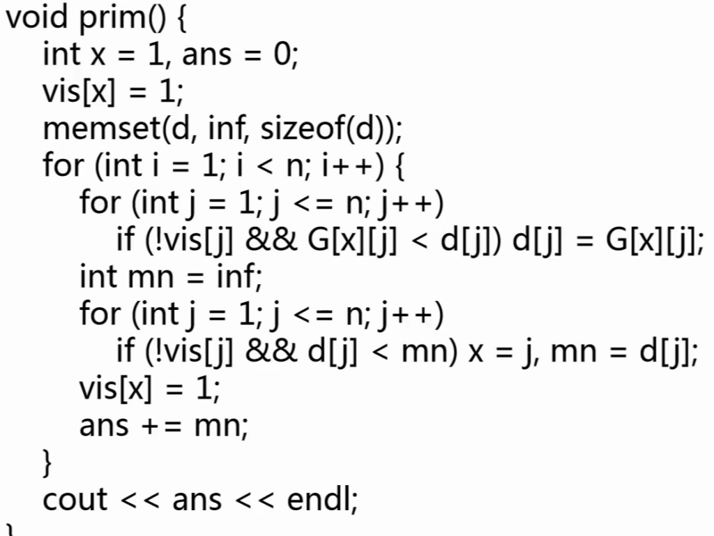

Prim 算法的思路和 Dijkstra 最短路算法非常相似，优化也基本相同。对于暴力做法中寻找最小值的步骤，可以使用优先队列优化到 $O(n+m\log{m})$。

### Kruskal 算法

将边权从小到大排序，一一尝试向最小生成树添加边，若边的端点不在同一个连通块内，则添加，时间复杂度为 $O(e\log{e})$。

代码示例：

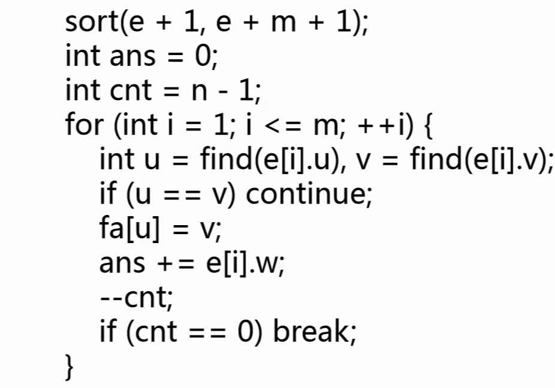

算法的正确性显然，对于放弃的边，其权值大于前面所有的边，因此产生环时应当首先放弃。时间复杂度瓶颈在排序操作上。

**例题：HDU7226**

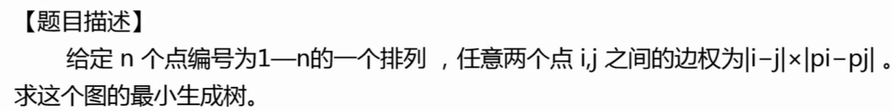

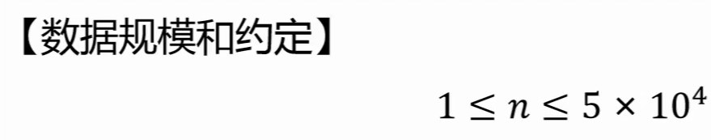

序列中所有数字之间的边构成一个完全图，但是不可能将这个完全图实际建出来，空间和时间上都无法接受。

如果我们直接按顺序连接所有点，那么每条边的边权都小于 `n`。因此，最小生成树中所有边权都应当小于 `n`，也就是 $|i - j| * |p_{i}-p_{j}|$ 小于 $n$，两个乘数有一个小于 $\sqrt{n}$。我们可以选择枚举 $i$ 在 1 到 n，$j$ 在 $i$ 到 $i+\sqrt{n}$，总时间复杂度为 $O(n\sqrt{n})$。

然后对这些边计算最小生成树，因此叠加后的时间复杂度为 $O(n\sqrt{n}\log{n}\sqrt{n})$。若时间复杂度较为紧张，还可以使用桶排进行 Kruskal 中的排序过程，将 $\log{n}$ 压缩。

**例题：洛谷 P2245 星际导航**

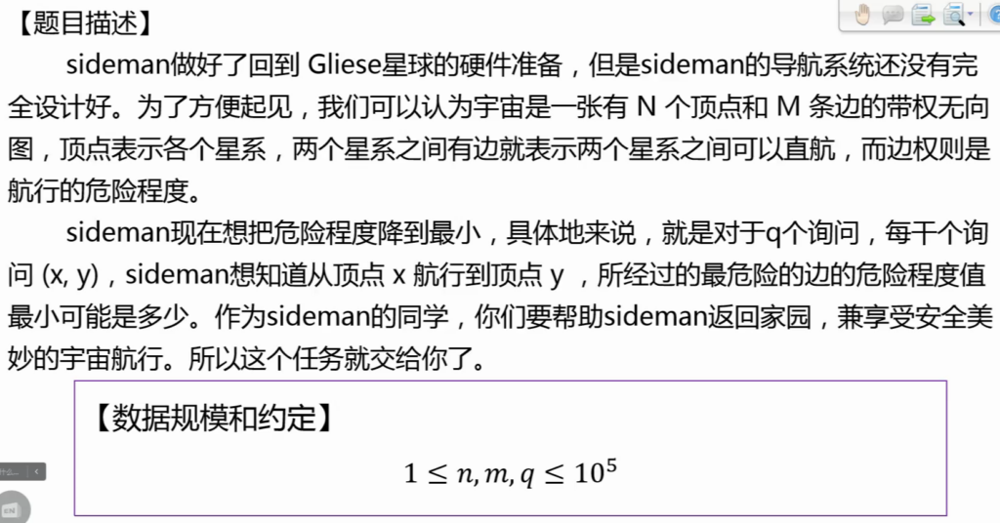

题意是寻找一条路径上边权的最大值。两个点之间可能有很多边，但是边权较大的边不会产生贡献，因此我们先对图运行 Kruskal 求最小生成树，这样两个点之间有唯一路径且一定最小（否则更短的边会出现在生成树中）。这样就可以通过 LCA 直接求出总边权。

另一种思路是使用 **Kruskal 重构树**，适用于最小生成树最大边权问题。

Kruskal 重构树的求解过程：

- 将边权从小到大排序；
- 每次选择边权最小的一条边，若其连接的两个点已经进入集合，则跳过；否则，将这两个点的祖先都连接到一个虚点上，点权为这条边的边权。

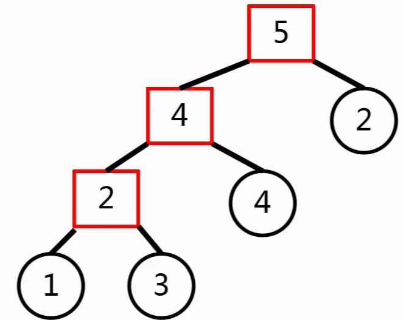

在这棵树上，两个节点之间的最大权值可以直接通过 LCA 求得，不需要单独维护。某些题目只能通过重构树的方式实现。

**例题：洛谷 P2619 边的限制问题**

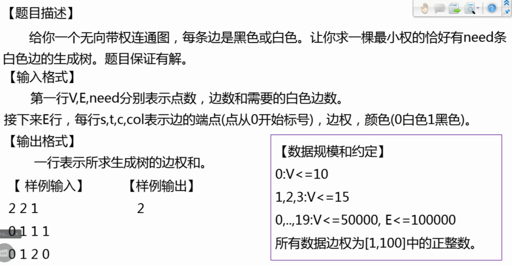

- 如果将所有白边加一个很大的权值，则所有白边都无法进入最小生成树；
- 如果将所有白边减一个很大的权值，则所有白边都可以进入最小生成树；
- 显然，这个权值具有单调性，可以通过二分答案寻找分界点，此时就是题目所求的最小生成树。

这种计算方法称为**带权二分**，是很重要的思想。

**例题：洛谷 P4180 严格次小生成树**

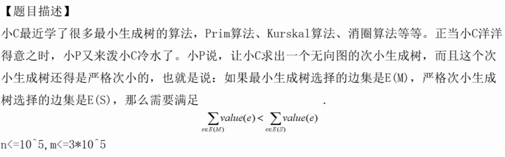

最简单的思路是先求出最小生成树，并每次删除集合中的最大值，添加集合外的最小值。这种贪心的算法很简单，但是不正确。

反例例如：

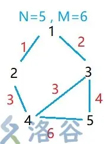

对于一个非严格次小生成树，添加的边权大于*等于*最小生成树，因此不是严格次小生成树。在添加新边时，不仅要维护环上的最大值，还要维护次大值。对于最初的最小生成树，进行倍增 LCA，分别记录最大和次大值，并在此后添加边时修改。

**例题：POJ2728 最优比率生成树**

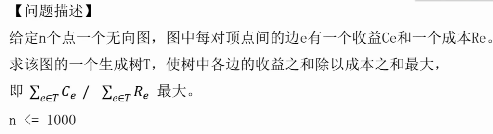

设比值大于等于 $k$，则可以变形为 $k\Sigma{R}-\Sigma{C}\leq0$，拆分则为 $(mid \times R_{1}-C_{1}) + (mid \times R_{2} - D_{2}) +\dots \leq 0$，可以二分求这个 $k$，并依次给边赋值，求图的最小生成时，边权的和是否小于 $k$；若小于，说明 $k$ 偏小，反则偏大。

这个方法是解决 01 分数规划的常见方法。

如果题意相反，是求最小值，则应当求最大生成树。

## 连通性算法

**例题：洛谷 P1656 炸铁路**

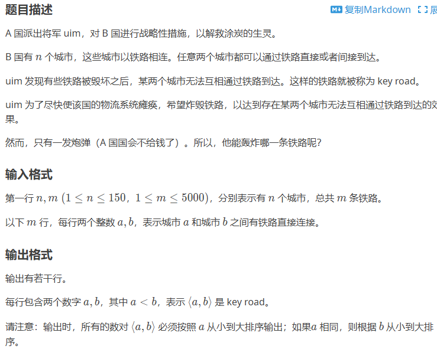

显然是求**割边**。

代码：

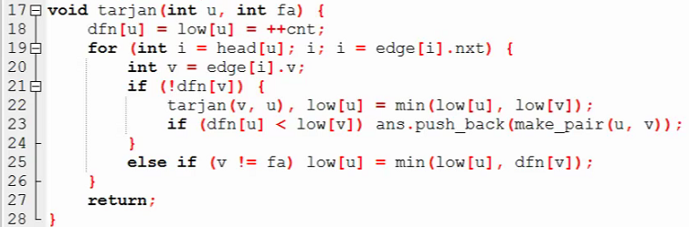

解释：

- $dfn_{u}$ 是访问到 $u$ 结点时的时间戳或顺序；
- $low_{u}$ 是 $u$ 能回到哪一个点；
- 以上两个值在 18 行初始化为点本身；
- 寻找与 $u$ 直接相邻的点，若这个点还没有被访问，则从这个点开始递归，并更新能够回到的点；
- 如果一条边是割边，则它的两个端点中一个的时间戳应当小于另一端能回到的点；
- 若这个点已经被访问，则更新能回到的点。

对于求割边，第 25 行的 $dfn_{v}$ 可以修改为 $low_{v}$，本质上就是一次性更新了能到达的最远祖先，可以跳过其间的点。

对以上代码进行修改，可以求**割点（洛谷 P3388）**。

【待补充】

代码：

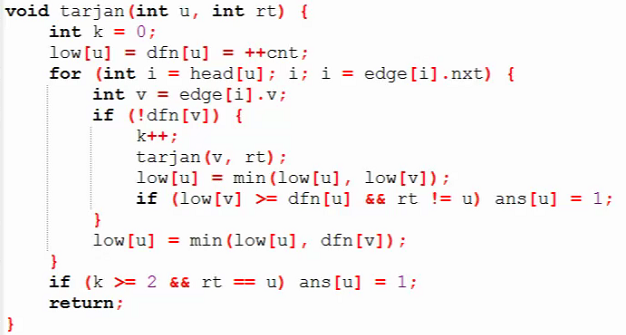

割点、割边的概念主要是针对无向图。

**强连通分量**是，在一个最大的无向图中，任意两点之间都有路径。默认单个点是一个强连通分量。

求强连通分量的例子：

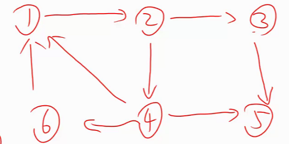

- DFS 找到 1，2，3，5，5 无法继续，是强连通分量；
- 返回到 3，仍然无法继续，是强连通分量；
- 返回到 4，深入到 4，发现可以回到 1，更新 $low$ 为 1；
- 深入到 6，发现可以回到 1，更新 $low$ 为 1；
- 回到 2，根据 4 更新 2 的 $low$ 为 1；
- 回到 1，DFS 结束。

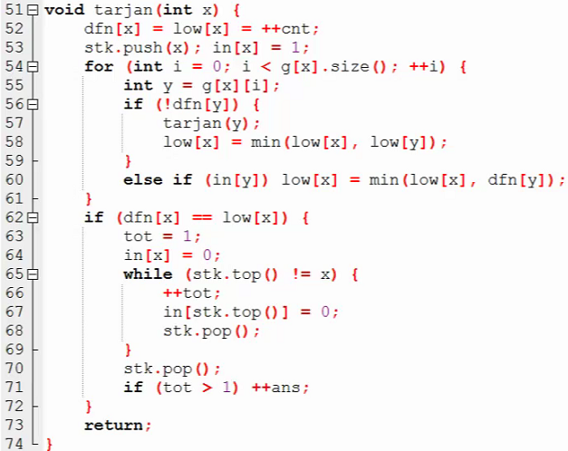

**例题：洛谷 P2272 最大半连通子图**

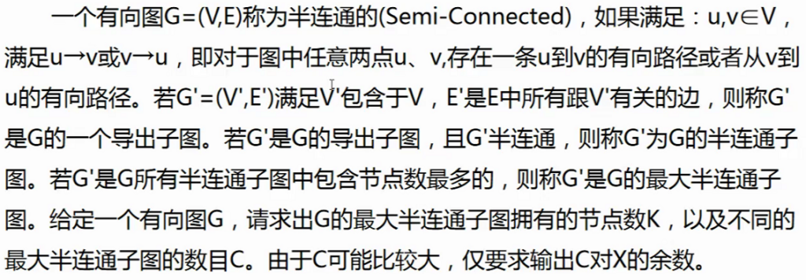

思路：首先将所有强连通分量求出，然后对它们进行缩点，形成一个 DAG，通过 DP 求 DAG 中的点权最大的路径。

【点双、边双连通分量跳过】

## 试题讲评

**洛谷 P7991 Connect Two Barns S**

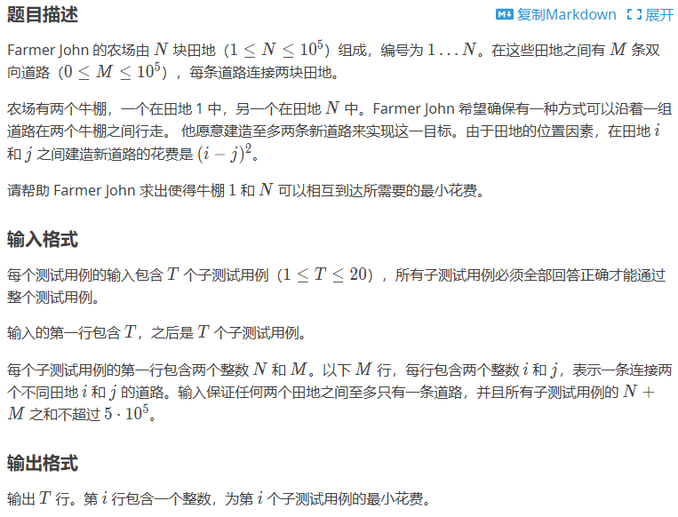

题意简述：有一个不一定连通的图，允许建立最多两条边，使 1 到 N 有路径。

首先将图分割为若干连通块，按数量分类：

- 有一个连通块：直接输出 `0`；
- 有两个连通块：加一条边，一定有两个相邻的点，输出 `1`；
- 有两个以上的连通块：包含 1 和 N 的连通块分别连接到其他连通块，求最小代价。

对于最后一个情况，枚举每个点，并二分查找包含 1 和 N 的连通块中最接近的点，求最小值。

**洛谷 P8191 Moo Network G**

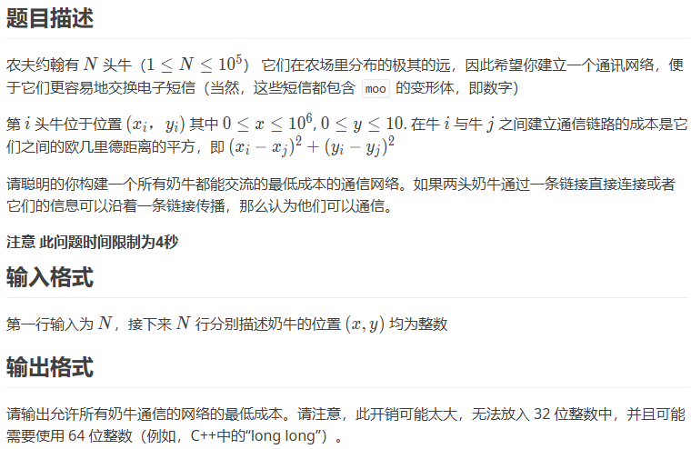

显然是最小生成树，如果全部建边就成了上文所述。由于 $y$ 的值很小，实际上连边只需要连 25 到 30 条边就可以抵消较小的 $y$ 产生的影响。

**洛谷 P7528 Portals G**

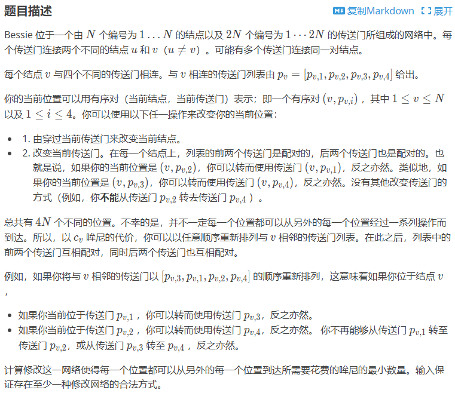

按照题意模拟，逐字理解。

**洛谷 P8328 Usmjeravanje**

题意简述：给定一些有向边和一些无向边，要求确定边的方向，使强连通分量数量最小。

【待补充】

## 下课！

又是被虐的一天！
