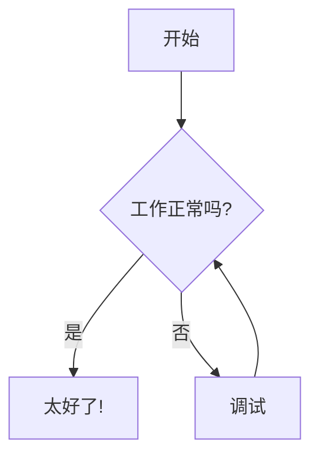
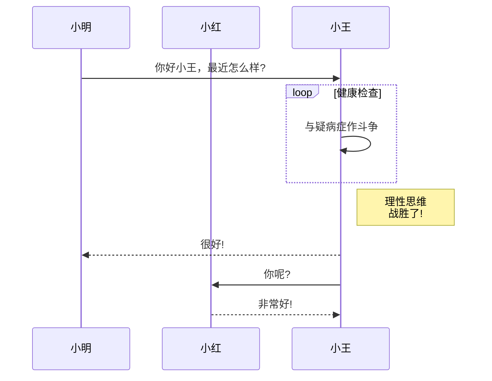
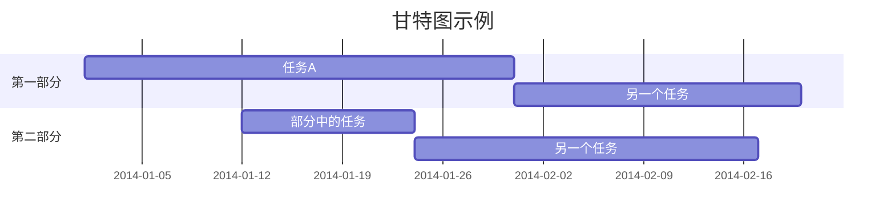
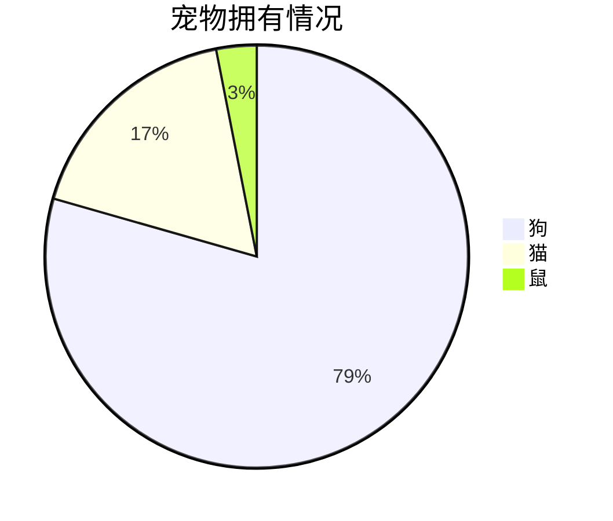

本文件包含标准Markdown语法示例以及扩展功能，如Mermaid图表和KaTeX数学表达式。

## 基本Markdown语法

### 标题

# 标题1
## 标题2
### 标题3
#### 标题4
##### 标题5
###### 标题6

替代标题格式:

标题1
=========

标题2
---------

### 强调

*这是斜体文本*

_这也是斜体文本_

**这是粗体文本**

__这也是粗体文本__

***这是粗体加斜体文本***

___这也是粗体加斜体文本___

~~这是删除线文本~~

### 列表

#### 无序列表

* 项目1
* 项目2
  * 子项目2.1
  * 子项目2.2
* 项目3

- 项目1
- 项目2
  - 子项目2.1
  - 子项目2.2
- 项目3

+ 项目1
+ 项目2
  + 子项目2.1
  + 子项目2.2
+ 项目3

#### 有序列表

1. 第一项
2. 第二项
3. 第三项
   1. 子项目3.1
   2. 子项目3.2
4. 第四项

#### 任务列表

- [x] 已完成任务
- [ ] 未完成任务
- [x] 另一个已完成任务
- [ ] 另一个未完成任务

### 链接

[基本链接](https://www.example.com)

[带标题的链接](https://www.example.com "示例网站")

<https://www.example.com> (自动链接)

### 图片


### 引用块

> 这是一个引用块
>
> > 这是一个嵌套引用块
>
> 回到第一级引用

### 代码

内联代码: `var example = "你好，世界";`

```
不带语法高亮的代码块
function test() {
  console.log("注意这个函数前面的空行吗？");
}
```

```javascript
// 带语法高亮的代码块
function test() {
  console.log("JavaScript的语法高亮");
}
```

### 水平分割线

---

***

___

### 表格

| 表头1 | 表头2 | 表头3 |
|----------|----------|----------|
| 单元格1 | 单元格2 | 单元格3 |
| 单元格4 | 单元格5 | 单元格6 |

| 左对齐 | 居中对齐 | 右对齐 |
| :--------- | :----------: | ----------: |
| 左       | 中       | 右       |

## 扩展Markdown功能

### 脚注

这是一个带有脚注的句子。[^1]

[^1]: 这是脚注内容。

### 定义列表

术语1
: 定义1

术语2
: 定义2a
: 定义2b

### 缩写

*[HTML]: 超文本标记语言
*[W3C]: 万维网联盟

HTML规范由W3C维护。

### 上标和下标

上标: X^2^, 2^10^

下标: H~2~O, CO~2~

### 表情符号

:smile: :heart: :thumbsup:

### 高亮

==这是高亮文本==

## Mermaid图表









## KaTeX数学表达式

$$ 
E = mc^2 
$$

当 $a \ne 0$ 时，$ax^2 + bx + c = 0$ 有两个解，它们是
$x = {-b \pm \sqrt{b^2-4ac} \over 2a}.$

$$\begin{array}{c}
\nabla \times \vec{\mathbf{B}} -\, \frac1c\, \frac{\partial\vec{\mathbf{E}}}{\partial t} &
= \frac{4\pi}{c}\vec{\mathbf{j}}    \nabla \cdot \vec{\mathbf{E}} & = 4 \pi \rho \\
\nabla \times \vec{\mathbf{E}}\, +\, \frac1c\, \frac{\partial\vec{\mathbf{B}}}{\partial t} & = \vec{\mathbf{0}} \\
\nabla \cdot \vec{\mathbf{B}} & = 0
\end{array}$$

$$\begin{pmatrix}
a & b \\
c & d
\end{pmatrix}$$

## GitHub风格Markdown

### 自动链接

www.example.com, https://example.com, 和 contact@example.com.

### 删除线

~一个波浪线~ 或 ~~两个波浪线~~.

### 表格

| a | b  |  c |  d  |
| - | :- | -: | :-: |
| 1 | 2  |  3 |  4  |

### GFM任务列表

* [x] @提及, #引用, [链接](), **格式化**, 和 <del>标签</del> 都支持
* [x] 需要列表语法 (支持任何无序或有序列表)
* [x] 这是一个完成的项目
* [ ] 这是一个未完成的项目

### 提示框

> [!注意]
> 一个注意事项

> [!警告]
> 一个警告

> [!重要]
> 重要信息

## 前置内容 (YAML)

```yaml
---
标题: Markdown语法测试
作者: 您的名字
日期: 2025-02-28
标签: [markdown, 语法, 测试]
---
```

## 注释

<!-- 这是一个不会被渲染的注释 -->

<!-- 
这是一个
多行注释
-->

## ASCII艺术

```
    _    _                 _ 
   / \  | | ___  ___ _   _| |
  / _ \ | |/ _ \/ __| | | | |
 / ___ \| |  __/\__ \ |_| |_|
/_/   \_\_|\___||___/\__, (_)
                     |___/   
```

## 嵌入HTML

<div style="background-color: #f0f0f0; padding: 10px; border-radius: 5px;">
  <h3>这是HTML块</h3>
  <p>带有<strong>格式化</strong>内容。</p>
  <ul>
    <li>项目1</li>
    <li>项目2</li>
  </ul>
</div>

<details>
  <summary>点击展开!</summary>
  
  ## 标题
  1. 一个编号列表
     * 带有一些
     * 子弹点
</details>

<kbd>Ctrl</kbd>+<kbd>Alt</kbd>+<kbd>Del</kbd>

<mark>标记文本</mark>

<span style="color:red">红色文本</span>

<center>居中文本</center>

## 告示框 (部分编辑器的扩展)

!!! note
    这是一个注释告示框。

!!! warning
    这是一个警告告示框。

!!! tip
    这是一个提示告示框。

## 换行和段落

这是一行文本。  
这是另一行，使用两个空格的换行。

这是一个空行后的新段落。
