我还是希望大家啊，多用歪克特，啊，尤其是我们现在有了，啊，凹凸，简洁而且方便。

> 本文中若无特殊说明，认为树的根节点的深度为 1。

## 树的直径

树上任意两个点之间的最长距离称为树的直径。

求树的直径，可以从任何一个节点 $x$ 开始 DFS，能到达的最远节点 $y$ 一定是直径的一端。再从 $y$ 开始 DFS，能到达的最远节点 $z$ 就是直径的另一端，$x$ 与 $y$ 的距离即为直径。

证明：

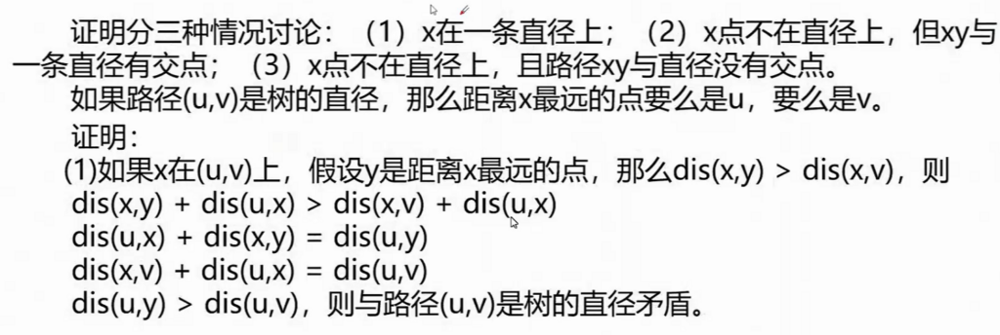

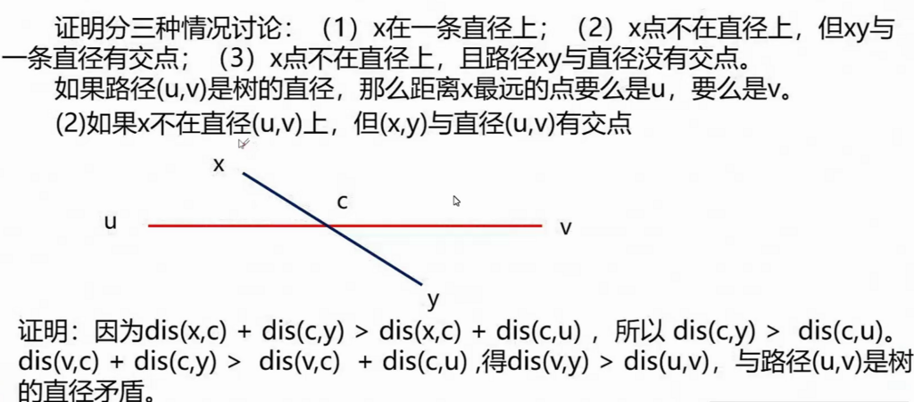

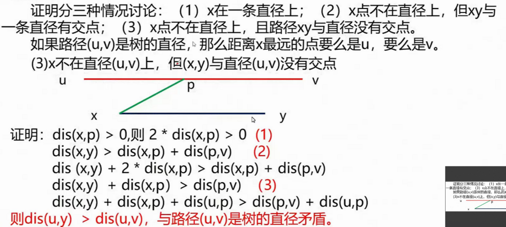

代码：

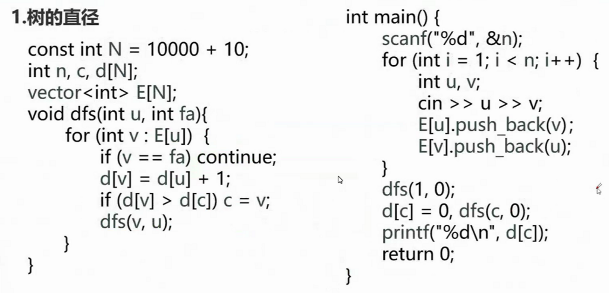

树的直径也可以使用树形 DP 计算，若设 1 为树根，那么设某个点向下能达到的最大和次大值是 $d1$ 和 $d2$，那么 $d1 + d2$ 最大时就是树的直径。

代码：

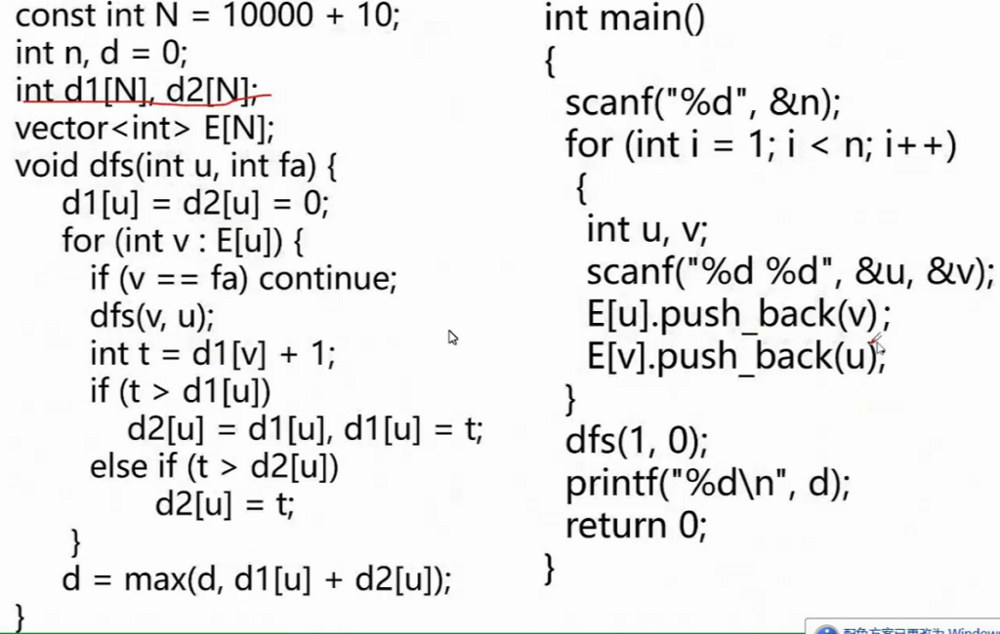

上述写法也可以压缩为一个数组，定义 $dp_{u}$ 是以 $u$ 为树根的子树中，从 $u$ 出发的最长路径，那么有转移方程 $dp_{u}=\max{dp_{u}, dp_{v}}$，其中 $v$ 是 $u$ 的子节点。对于求直径的过程，我们可以在转移时打擂求最大值。

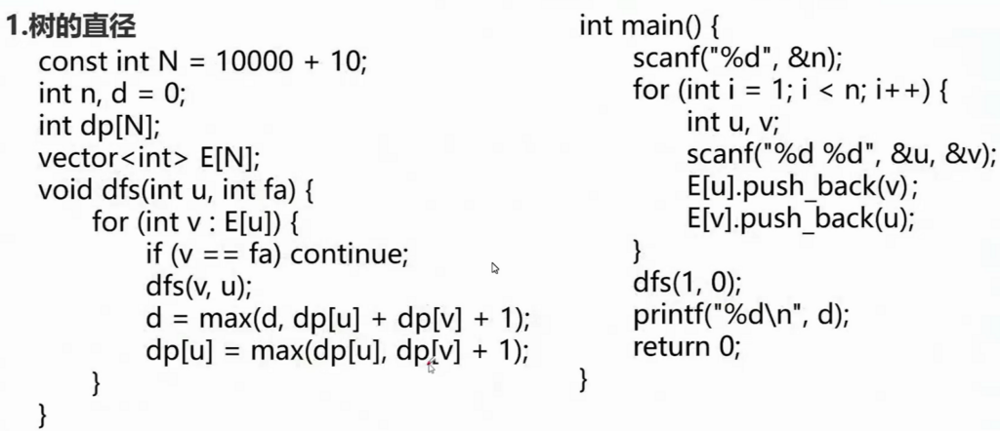

## 树的中心

选定一个点作为树的根节点，使得叶节点到根节点的最大距离最小，这个点称为树的中心。

树的中心一定在直径上，且趋于两个端点的中点，因此可以在找出直径的同时，求出其到每个节点的距离。

代码：

```
#include<cstdio>
#include<iostream>
#define re register
#define maxn 100010
using namespace std;
inline int read()
{
	int x=0,f=1; char ch=getchar();
	while(ch<'0'||ch>'9'){if(ch=='-')f=-1;ch=getchar();}
	while(ch>='0'&&ch<='9'){x=x*10+ch-'0';ch=getchar();}
	return x*f;
}
struct Edge{
	int v,w,nxt;
}e[maxn<<2];
int x,y,z;
int pos1,pos2,d[maxn],d1[maxn],d2[maxn];
int n,tmp1,tmp2,tmp3,ans,pos,cnt,head[maxn];
inline void add(int u,int v,int w)
{
	e[++cnt].v=v;
	e[cnt].w=w;
	e[cnt].nxt=head[u];
	head[u]=cnt;
}
void dfs1(int u,int fa,int dis)
{
	for(int i=head[u];i;i=e[i].nxt)
	{
		int ev=e[i].v;
		if(ev==fa) continue;
		dfs1(ev,u,dis+e[i].w);
	}
	d[u]=dis;
	if(dis>tmp2) tmp2=dis,tmp1=u;
}

int main()
{
	n=read();
	for(re int i=1;i<n;++i)
	{
		x=read(),y=read(),z=read();
		add(x,y,z);
		add(y,x,z);
	}
	dfs1(1,0,0);
	pos1=tmp1;
	tmp2=0,tmp1=0;
	dfs1(pos1,0,0);
	pos2=tmp1;
	tmp2=0,tmp1=0;
	//找到直径了 
	for(re int i=1;i<=n;++i) d1[i]=d[i];
	dfs1(pos2,0,0);
	for(re int i=1;i<=n;++i) d2[i]=d[i];
	ans=0x3f3f3f3f;
	for(re int i=1;i<=n;++i)
	{
		if(ans>max(d1[i],d2[i]))
		ans=max(d1[i],d2[i]),pos=i;
	}
	printf("%d %d",pos,ans);
	return 0;
}
```

## 树的重心

选择树中的一个节点并删除，使得分成的所有子树的最大节点数最小，这个点称为树的重心。树的重心若不唯一，则一定有两个。

代码：

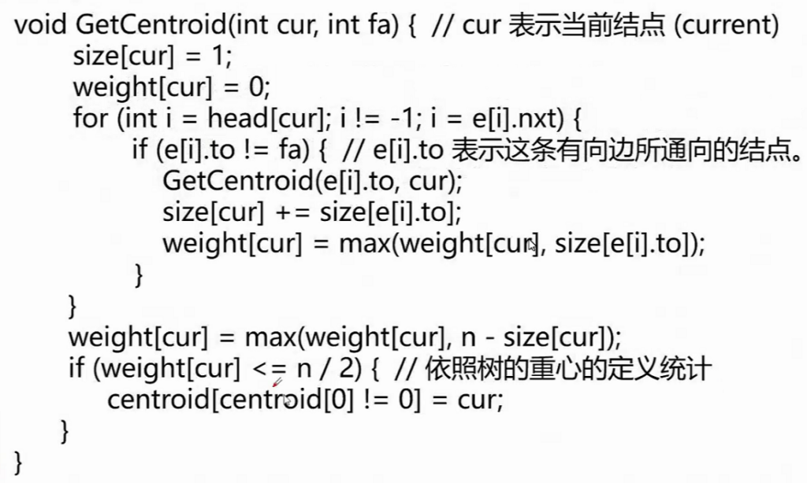

## 最近公共祖先

求最近公共祖先的朴素方法是，先让较深的节点向其父亲跳，直到深度相同，然后两个节点同时向上跳，直到相遇，时间复杂度 $O(n)$。

对于朴素算法的上跳过程，可以通过倍增进行优化。通过预处理 $fa$ 数组，将原本的跳跃次数 $y$ 分为其二进制位对应的跳跃。预处理时间复杂度 $O(n\log{n})$，查询时间复杂度 $O(\log{n})$。

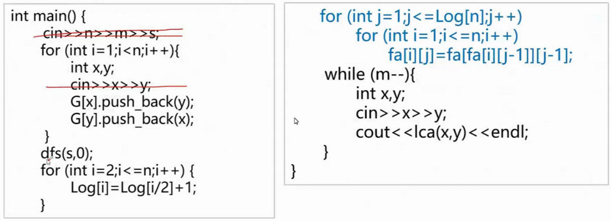

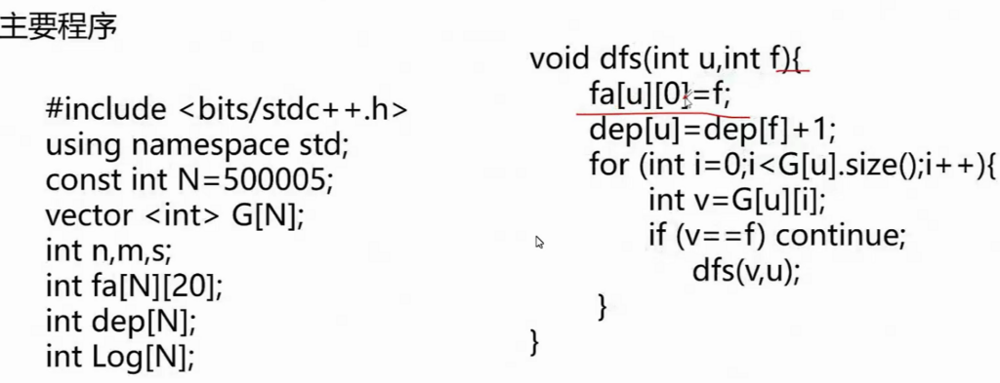

## 树上差分

**例题：洛谷 P3128 Max Flow P**

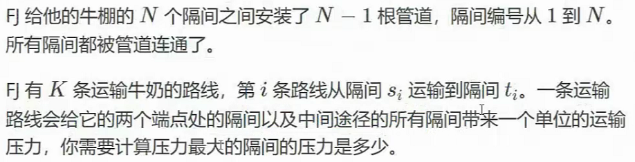

对每条路径的起点和终点求 LCA，将路径上所有边的权值都加 1，然后求边权最大值。但是如果真的一一添加会超时，可以使用树上差分进行优化。

需要注意由于树上差分若对于 $w_{a}$ 和 $w_{b}$ 均加上 1，处于路径交汇点的 LCA 实际上加 2。为了抵消影响，需要对 $w_{lca}$ 减去 1；同时由于填充实际数值时会将 $w_{lca}$ 的变化向上波及，还需要对 $w_{fa_{lca}}$ 减去 1，抵消影响。

## 树上贪心

**例题：ABC333D**

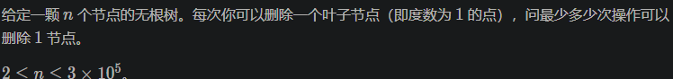

由于我们希望删除的点最少，因此保留的子树一定是最大的，在每次删除时贪心地选择最小的子树即可。

## 树上 DP

**例题：洛谷 P1122**

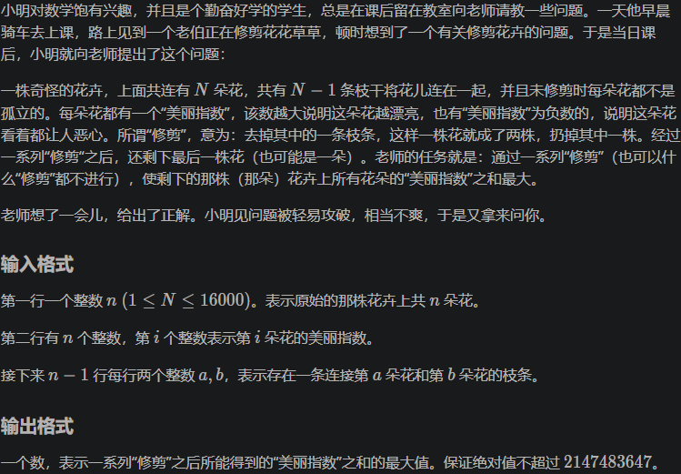

树上 DP 的基本思路是将子树的状态转移到根节点上。

代码：

```
#include <cstdio>
#include <algorithm>
#include <vector>
using namespace std;
int n,a[16005],f[16005],ans=-2147483647;
vector <int> E[16005];
void dfs(int u,int fa)
{
    f[u]=a[u];//f初始值
    for(int i=0;i<E[u].size();i++)
    {
        int t=E[u][i];
        if(t!=fa)
        {
            dfs(t,u);
            if(f[t]>0)
                f[u]+=f[t];//如式
        }
    }
}
int main()
{
    scanf("%d",&n);
    for(int i=1;i<=n;i++)
        scanf("%d",&a[i]);//点权输入
    for(int i=1;i<n;i++)
    {
        int u,v;
        scanf("%d%d",&u,&v);
        E[u].push_back(v);
        E[v].push_back(u);//vector双向连边
    }
    dfs(1,0);
    for(int i=1;i<=n;i++)
        ans=max(ans,f[i]);//找出最大点权和
    printf("%d",ans);
    return 0;
}
```

## 树上揹包

**例题：P2014 选课**

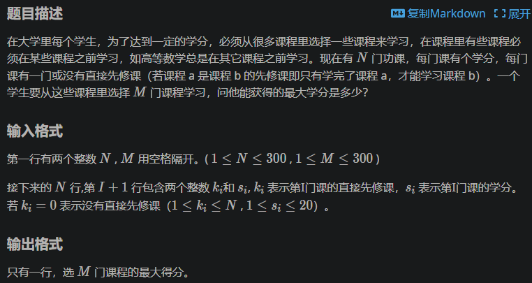

由于本题没有给出作为树根的节点，可以将 0 作为虚根，设 $dp_{i,j}$ 表示前 $i$ 个子节点、选择 $j$ 门课，滚动数组压缩树根的维度。

## 换根 DP

**例题：ABC348E**

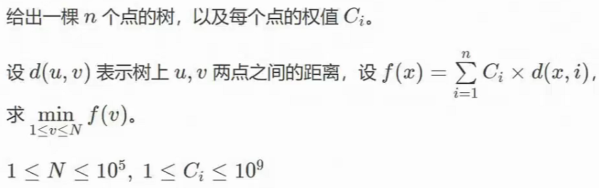

我集训五天以来第一道一遍 AC 的题目！

- 第一次 DFS，初始化深度、LCA 倍增数组；
- 第二次 DFS，求每个节点及其子树的权值和；
- 第三次 DFS，求以 1 为根的总和；
- 第四次 DFS，根据节点之间的关系和子树和，求出以其他点为根时的总和。

代码：

```
#include <bits/stdc++.h>
#define int long long

using namespace std;
int n;
struct edge {
	int f, t;
	int n;
} e[220000];
int ec;
int pre[120000];
int w[120000];
int nw[120000];
int tot_w;

void add(int f, int t) {
	e[++ec].f = f;
	e[ec].t = t;
	e[ec].n = pre[f];
	pre[f] = ec;
}

int v[120000];
int dep[120000];
void dfs_tot(int x, int f) {
	dep[x] = dep[f] + 1;
	nw[x] = w[x];
	for (int i = pre[x]; i; i = e[i].n) {
		if (e[i].t != f) {
			dfs_tot(e[i].t, x);
			nw[x] += nw[e[i].t];
		}
	}
}

int tot_c;
int dfs4root(int x, int f) {
	int tw = w[x] * (dep[x] - 1);
	for (int i = pre[x]; i; i = e[i].n) {
		if (e[i].t != f) {
			tw += dfs4root(e[i].t, x);
		}
	}
	return tw;
}

void dfs_de(int x, int f) {
	for (int i = pre[x]; i; i = e[i].n) {
		if (e[i].t != f) {
			v[e[i].t] = v[x] - nw[e[i].t] + (tot_w - nw[e[i].t]);
			dfs_de(e[i].t, x);
		}
	}
}

signed main() {
	cin >> n;
	for (int i = 1; i < n; i++) {
		int f, t;
		cin >> f >> t;
		add(f, t), add(t, f);
	}
	for (int i = 1; i <= n; i++) {
		cin >> w[i];
		tot_w += w[i];
	}
	dfs_tot(1, 0);
	v[1] = dfs4root(1, 0);
	dfs_de(1, 0);
	int min_w = LLONG_MAX;
	for (int i = 1; i <= n; i++) {
		min_w = min(min_w, v[i]);
	}
	cout << min_w << endl;
	return 0;
}
```

## 树上 LIS

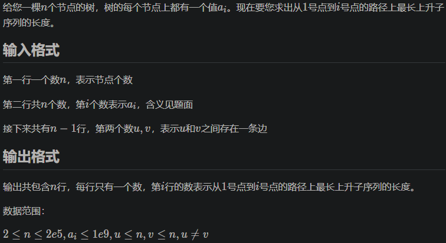

对于树上每一条路径，用优化后的 LIS 算法 $O(n\log{n})$ 地求出 LIS，并在递归中继承和回溯。

难点在于回溯操作，可以提前记录修改操作，并在子树处理之后撤销。

## 树上二分

**例题：洛谷 P3000 Cow Calisthenics G**

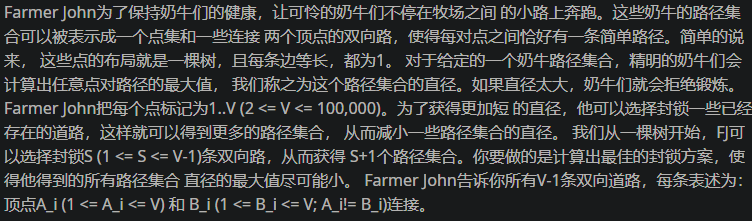

首先要求求最大值的最小值，应为二分答案。

我们从下往上遍历，如果添加一条边之后最长路径超过了二分的答案，贪心地要求保留边长最小的边，那么就应当删去子树的根与最长路径之间的连边，这样保留的边一定最小，不具有后效性。

## 综合

**例题：洛谷 P6869 Putovanje**

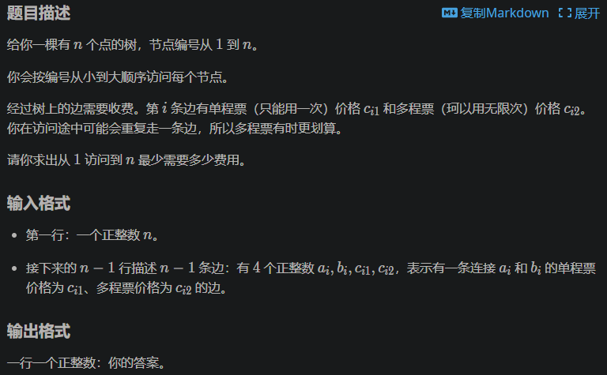

由于题目要求按顺序走完所有节点，因此两两之间的最优路径是唯一的，否则至少不能省去代价。对于一对起点和终点，最短就是到 LCA 的距离，将路径经过的所有边标记。但是这样可能超时（尤其是在 YZZX 孱弱的评测机上），因此要使用树上差分优化，最后一次性计算。

## 下课！

您达成了新的成就——每题都有分！
