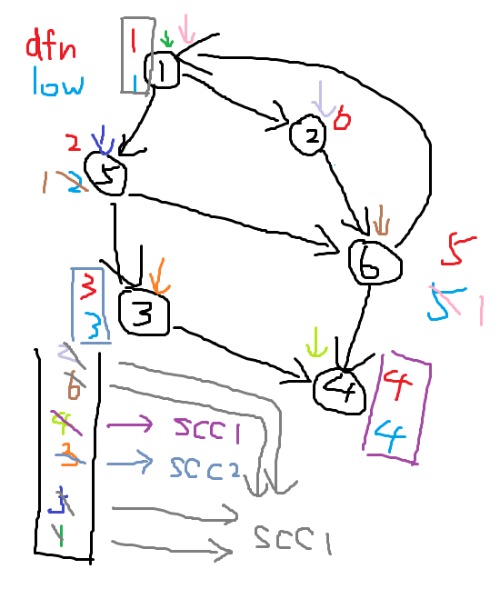

**图的连通性问题**主要包括：

- 割边和割点；
- 强连通分量和缩点；
- 边双连通分量和点双连通分量。

求解这些问题，效率最高、思路最清晰的算法是 **Tarjan** 算法，由**罗伯特·恩卓·塔扬**发明。塔扬研究了并查集、图论等许多领域，因此有很多以他名字命名的算法，这里是指关于图的连通性问题的算法。

## 割边和割点

不大严谨、完全不形式化的定义：

- **割边**：如果删除图上的某条边，图就不再连通，那么这条边就是图的割边。
- **割点**：如果删除图上的某个点以及与其相连的所有边，图就不再连通，那么这个点就是图的割点。

暴力求解这个问题，可以枚举删除某一条边或者某一个点，然后通过 DFS 判断连通性，平均时间复杂度是 $O(n^2)$。

首先需要了解的是 **DFS 树**。DFS 树是从图上任意一点开始 DFS，由 DFS 顺序所构成的一棵树，开始点对于答案没有影响。在树上出现的边称为**树边**，否则称为**非树边**。

在割边和割点问题中，一般只研究无向图。非树边在 DFS 树中以**返祖边**的形式出现，其含义就是字面含义。

### 割点

割点可以分为两种情况：

- 根节点在 DFS 树中有多余一个子节点，那么它就是割点；
- 对于一个非根节点，它的子树中至少有一棵，不存在一条返祖边可以回到它的祖先节点。

第一种请款很简单；第二种情况，如果子树上存在到它的祖先的返祖边，当它被删除之后，这棵子树仍然可以通过返祖边到达原本节点的祖先。

求割点的方法：

- $dfn_{i}$ 表示节点 $i$ 的时间戳，或者也可以说是节点在 DFS 树中的深度，通过其大小比较可以判断祖先与子孙的关系；
- $low_{i}$ 表示节点 $i$ 不经过其父节点能到达的 $dfn$ 最小的祖先。（这个概念大部分博客都没有讲清楚，我搜遍互联网终于找到了对其的明确定义，特此感谢：[Tarjan 算法求解无向图的割点与割边](https://skywt.cn/blog/tarjan-cut-vertex-cut-edge/)，可惜的是这篇博客下面的代码是错误的。）

对于一个节点 $v$ 及其祖先 $u$，如果回溯时发现 $low_{v} \geq dfn_{u}$，也就是说 $v$ 回不到 $u$ 的祖先（取等，因为此时与 $3$ 相连的所有边都被删除，所以不可能到达）。

还需要注意，当一个节点的子节点已经被访问，更新应当使用 `dfn[e[i].t]` 而非 `low[e[i].t]`。若使用后者，会导致割点的子节点使用割点能访问的祖先节点更新，那这就白跑了。

代码实现（可以根据注释理解）：

```
#include <bits/stdc++.h>

using namespace std;
int n, m;
struct edge {
    int f, t;
    int n;
} e[220000];
int ec;
int pre[22000];
int dfn[22000], low[22000];
set<int> ce;
bool vis[22000];
int ro;

void add(int f, int t) {
    e[++ec].f = f;
    e[ec].t = t;
    e[ec].n = pre[f];
    pre[f] = ec;
}

int dfs_cnt;
void dfs(int c, int f) { // `c`: current node, `f`: father node
    vis[c] = true;
    dfn[c] = low[c] = ++dfs_cnt; // Update the current timestamp
    int sc = 0; // The number of children, in case this is root
    for (int i = pre[c]; i; i = e[i].n) {
        if (!vis[e[i].t]) { // Not visited, indicating it's reached for the first 
                            // time and thus cannot reach an ancestor
            sc++;
            dfs(e[i].t, c); // Go to children and thus recall
            low[c] = min(low[c], low[e[i].t]); // Update ancestors that `c` 
                                               // reach by its subtree
            if (c != ro && low[e[i].t] >= dfn[c]) { // Indicating that its subtree cannot reach 
                                                    // `c`'s ancestors
                                                    // SO NODE `C` IS AN CUT NODE
                ce.insert(c);
            }
            if (c == ro && sc >= 2) {
                ce.insert(c); // If `c` is root and has more than one subtree,
                                 // obviously it's a cut node
            }
        } else {
            if (e[i].t != f) { // Visited before, so `c` could reach what 
                               // `e[i].t` could reach
                low[c] = min(low[c], dfn[e[i].t]);
            }
        }
    }
}

int main() {
    cin >> n >> m;
    for (int i = 1; i <= m; i++) {
        int f, t;
        cin >> f >> t;
        add(f, t), add(t, f);
    }
    for (int i = 1; i <= n; i++) {
        if (!vis[i]) {
            ro = i;
            dfs(i, 0);
        }
    }
    cout << ce.size() << endl;
    for (auto k: ce) {
        cout << k << " ";
    }
    cout << endl;
    return 0;
}
```

注意去重，因为如果割点不止一棵子树不能返祖，那么就会重复添加。（硬控我半小时。）

对应例题：[P3388 【模板】割点（割顶）](https://www.luogu.com.cn/problem/P3388)（[通过记录](https://www.luogu.com.cn/record/191106609)）

### 割边

割边更加简单，不需要考虑割点中的第一种情况，直接比较每个点的最远返祖边即可。需要注意在求割点中，上述取等是不成立的，因为还有可能不经过这条边，转而绕行另一个节点，到达子节点。

代码实现：

```
// Related variables
bool vis[120000]; // If visited
int dfn[120000], low[120000]; // As mentioned above
struct edge {
    int f, t;
    int n;
} e[220000];
int ec;
int pre[120000]; // Standard "chain forward star" (?)
vector<int> ce; // Keep cut edges
int n, m; // Node & Edge sums

void dfs(int c, int f) { // `c`: current node, `f`: father node
    vis[c] = true;
    dfn[c] = low[c] = dfn[f] + 1; // Update the current timestamp
    for (int i = pre[c]; i; i = e[i].n) {
        if (!vis[e[i].t]) { // Not visited, indicating it's reached for the first 
                            // time and thus cannot reach an ancestor
            dfs(e[i].t, c); // Go to children and thus recall
            low[c] = min(low[c], low[e[i].t]); // Update ancestors that `c` 
                                               // reach by its subtree
            if (low[e[i].t] > dfn[c]) { // Indicating that its subtree cannot reach 
                                   // `c`'s ancestors
                                   // SO EDGE `I` IS AN CUT EDGE
                ce.push_back(i);
            }
        } else {
            if (e[i].t != f) { // Visited before, so `c` could reach what 
                               // `e[i].t` could reach
                low[c] = min(low[c], dfn[e[i].t]);
            }
        }
    }
}
```

对应例题：[P1656 炸铁路](https://www.luogu.com.cn/problem/P1656)（[通过记录](https://www.luogu.com.cn/record/191086637)）

这两则代码需要对应起来看，注意其间的区别，就像 Dijkstra 和 SPFA 一样一眼看上去很像，但是如果有一点细节错了就会拖很长时间。

## 强连通分量和缩点

**强连通分量**：在一个**有向图**中，最大的强连通子图称为这张图的强连通分量。强连通是指一张有向图中任何两个节点之间都双向可达（可以经过其他点）。

其实求强连通分量还有另一种两遍 DFS 的方法，但是为了保持本文的统一性，我们还是继续使用 Tarjan 算法。

用于求强连通分量的 Tarjan 模板与割边没有本质性区别。我们用一个栈保存当前所遍历到的点，当我们发现某个节点 $u$ 的 DFS 子树全部遍历完成之后，$dfn_{u}=low_{u}$，说明现在栈内的所有元素（都是 $u$ 的子节点）属于的强连通分量结束了，因为根节点已经无法到达时间戳更早的祖先了。

Upd：我前一天晚上自信地写下了上面这段，然后发现没法理解自己的说法，今天又从头模拟了一边，详细说说为什么 SCC（Strongly Connected Components）与割点和割边的写法有区别。



辨色力大赛，灵魂画手大赛，相同颜色对应的是同一步操作，叙述一下，理解的同学可以跳过：

- 从根节点 1 出发，$dfn_{1}=1$，$low_{1}=1$；
- 到达 5，记录 $dfn_{5}=2$ 和 $low_{5}=2$，压栈；
- 到达 3，记录 $dfn_{3}=3$ 和 $low_{3}=3$，压栈；
- 到达 4，记录 $dfn_{4}=4$ 和 $low_{4}=4$，压栈；
- 4 的子树（并没有）遍历结束，$dfn_{4}=low_{4}$，记为第 1 个 SCC，只包含 4，弹栈、取消标记；
- 回溯，3 的子树遍历结束，$dfn_{3}=low_{3}$，记为第 2 个 SCC，只包含 3，弹栈、取消标记；
- 回溯到 5，从 5 到达 6，压栈；
- 从 6 到达 1，压栈，用 $low_{1}=1$ 更新 $low_{6}=1$；
- 回溯，从 6 到达 4，但是此时 4 不在栈中，不可以更新：因为已经处理完的 SCC 相当于已经从图中删去，不再加入 DFS 树；
- 回溯到 5，根据 $low_{6}$ 更新 $low_{5}=1$；
- 回溯到 1，前往 2，记录 $dfn_{6}=2$ 和 $low_{2}=6$，压栈；
- 前往 6，发现在栈内，可以更新，$low_{2}=1$；
- 1 的子树遍历结束，$dfn_{4}=low_{4}$，记为第 3 个 SCC，包含 1，2，5，6，弹栈、取消标记；
- 结束！

可以发现最大的区别是在判断是否通过已经经过的、当前节点的子节点是否可以用于更新当前节点。在割点中，我们允许所有非 DFS 树上的父亲节点进行更新，但是这里一方面因为是有向图，一方面因为已经处理完的 SCC 不属于当前的 SCC，而未处理的应当直接进行更新——不允许更新。

另外有一个性质，就是完成遍历之后会发现，同一个强连通分量内，所有节点的 $low$ 都是相同的。

代码实现：

```
#include <bits/stdc++.h>

using namespace std;
int n, m;
struct edge {
    int f, t;
    int n;
} e[220000];
int ec;
int pre[12000];
bool vis_scc[12000];

void add(int f, int t) {
    e[++ec].f = f;
    e[ec].t = t;
    e[ec].n = pre[f];
    pre[f] = ec;
}

int dfn[12000], low[12000];
int ts;
stack<int> s;
vector<set<int>> v;
bool in_s[12000];
int scc[12000];
int scc_id;
void dfs(int c) {
    dfn[c] = low[c] = ++ts;
    s.push(c);
    in_s[c] = true;
    for (int i = pre[c]; i; i = e[i].n) {
        if (!dfn[e[i].t]) {
            dfs(e[i].t);
            if (low[e[i].t] < low[c]) {
                low[c] = low[e[i].t];
            }
        } else if (in_s[e[i].t]) {
            low[c] = min(low[c], low[e[i].t]);
        }
    }
    if (dfn[c] == low[c]) {
        scc_id++;
        set<int> k;
        while (s.top() != c) {
            scc[s.top()] = scc_id;
            in_s[s.top()] = false;
            k.insert(s.top());
            s.pop();
        }
        scc[s.top()] = scc_id;
        in_s[s.top()] = false;
        k.insert(s.top());
        s.pop();
        v.push_back(k);
    }
}

int main() {
    cin >> n >> m;
    for (int i = 1; i <= m; i++) {
        int f, t;
        cin >> f >> t;
        add(f, t);
    }
    for (int i = 1; i <= n; i++) {
        if (!dfn[i]) {
            dfs(i);
        }
    }
    cout << v.size() << endl;
    for (int i = 1; i <= n; i++) {
        if (!vis_scc[scc[i]]) {
            for (auto k: v[scc[i] - 1]) {
                cout << k << " ";
            }
            cout << endl;
            vis_scc[scc[i]] = true;
        }
    }
    return 0;
}
```

对应例题：[洛谷 B3609 [图论与代数结构 701\] 强连通分量](https://www.luogu.com.cn/problem/B3609)（[通过记录](https://www.luogu.com.cn/record/191277205)）

插句闲话，其实我一直觉得现在通常对 Tarjan 中一些变量的命名很不合理，按照我的理解，应当改成：

- `dfn` 变成 `ts` 即 timestamp，时间戳；
- `low` 变成 `hfa` 即 highest father，不通过 DFS 树直接父亲就可以访问的最远祖先。

同意的同学可以在自己的代码里这样用，但是本文为了照顾已经看过很多其他博客的同学，就使用常见的命名方式了。

**缩点**：将一个强连通分量缩为一个点，作为整体计算的方法。

在一些情况下，例如我们需要计算路径的最大值，很明显如果存在一个环，我们会将它走完再离开——反正走完之后还是回到原点，对于结果没有影响，为啥不走一下呢？这时候我们就需要提前计算出强连通分量并将其缩为一个点，权值是子图原本权值的和，否则每次经过都需要将整个子图重跑一遍。

缩点的实现就是在强连通分量的基础上，建立一张新图，并为每一个强连通分量建立一个点，具体实现相信大家自己就可以做出来，洛谷上的模板题 [P3387 【模板】缩点](https://www.luogu.com.cn/problem/P3387)在强连通分量的基础上还要求出最长距离，需要通过 DP 和拓扑排序来做，我就不写了（太太太太长了），大家可以自己看看题解，然后敲出来。

## 边双连通分量和点双连通分量

**双连通**：对于一对点 $u$ 和 $v$ 来说，如果将它们之间的边删去任何一条，都不能使其不连通，则称 $u$ 和 $v$ 双连通；对于一对边 $i$ 和 $j$ 来说，如果将它们之间的点删去任何一个，都不能使其不连通，则称 $i$ 和 $j$ 双连通。

点双连通分量具有一些性质：

- 不存在割点；
- 两个点双连通分量之间如果存在公共点，则这个点是割点；
- 无向连通图上，非割点只属于一个点双连通分量，割点属于至少两个点双连通分量。

求解点双连通分量，代码和割点基本是一模一样，毕竟割点两侧的子图不就是点双连通分量嘛。相应地，边双连通分量之间是割边，但是需要使用 DFS 跑一遍连通块，因为无法确定将哪个节点入栈。

我实在是来不及写了（还有 4 天 NOIP），就摘抄一份[博客](https://www.cnblogs.com/Multitree/p/17123735.html)的代码（CC-BY 4.0），作者是[北烛青澜](https://www.cnblogs.com/Multitree)，感谢：

```
#include<bits/stdc++.h>
#define N 10001000
using namespace std;
struct sb{int u,v,next;}e[N];
int n,m,cnt,head[N],dfn[N],low[N],tot,stk[N],top,bcc;//bcc存放当前的点双连通分量的数量 
vector<int>ans[N];//存放答案 
inline void add(int u,int v)
{
	e[++cnt].u=u;
	e[cnt].v=v;
	e[cnt].next=head[u];
	head[u]=cnt;
}
inline void tarjan(int x,int fa)//fa是x的父节点 
{
	dfn[x]=low[x]=++tot;
	stk[++top]=x;
	int ch=0;//ch存放子节点的数量 
	for(int i=head[x];i;i=e[i].next)
	{
		int v=e[i].v;
		if(!dfn[v])//如果当前点还没有搜索过 
		{
			ch++;//子节点加一 
			tarjan(v,x);//继续往下搜 
			low[x]=min(low[x],low[v]);//正常更新low[x]的值 
			if(low[v]>=dfn[x])//割点的判定条件 
			{
				bcc++;//点双连通分量的数量加1 
				while(stk[top+1]!=v)//如果上一个弹出的栈顶元素不是v的话就一直弹 
					ans[bcc].push_back(stk[top--]);//将当前点放入栈中 
				ans[bcc].push_back(x);//最后把割点给加进去 
			}
		}
		else if(v!=fa)//不能用父节点来更新当前点的low值 
		  low[x]=min(low[x],dfn[v]);
	}
	if(fa==0&&ch==0)//特判只有一个点的情况 
	  ans[++bcc].push_back(x);
}
signed main()
{
	cin>>n>>m;
	for(int i=1;i<=m;i++)
	{
		int u,v;
		cin>>u>>v;
		add(u,v);
		add(v,u);
	}
	for(int i=1;i<=n;i++)
	{
		if(!dfn[i])
		{
			top=0;
			tarjan(i,0);
		}
	}
	cout<<bcc<<endl;
	for(int i=1;i<=bcc;i++)
	{
		int siz=ans[i].size();
		cout<<siz<<" ";
		for(int j=0;j<siz;j++)
		  cout<<ans[i][j]<<" ";
		cout<<endl;
	}
	return 0;
}
#include<bits/stdc++.h>
#define N 2000005
using namespace std;
int n,m,head[N],dfn[N],low[N],dcc,vis[N],tot,cnt=1;
struct sb{int u,v,next,flag;}e[N<<1];
vector<int>ans[N];
inline void add(int u,int v)
{
	e[++cnt].u=u;
	e[cnt].v=v;
	e[cnt].next=head[u];
	head[u]=cnt;
}
void tarjan(int x,int fa)
{
	dfn[x]=low[x]=++tot;
	for(int i=head[x];i;i=e[i].next)
	{
		int v=e[i].v;
		if(!dfn[v])
		{
			tarjan(v,x);
			low[x]=min(low[x],low[v]);
			if(low[v]>dfn[x])
			  e[i].flag=e[i^1].flag=1;
		}
		else if(v!=fa)low[x]=min(low[x],dfn[v]);
	}
}
void dfs(int x)
{
	ans[dcc].push_back(x);
	vis[x]=1;
	for(int i=head[x];i;i=e[i].next)
	{
		int v=e[i].v;
		if(vis[v]||e[i].flag)continue;
		dfs(v);
	}
}
signed main()
{
	cin>>n>>m;
	for(int i=1;i<=m;i++)
	{
		int u,v;
		cin>>u>>v;
		add(u,v);
		add(v,u);
	}
	for(int i=1;i<=n;i++)
	  if(!dfn[i])
	    tarjan(i,0);
	for(int i=1;i<=n;i++)
	{
		if(!vis[i])
		{
			dcc++;
			dfs(i);
		}
	}
	cout<<dcc<<endl;
	for(int i=1;i<=dcc;i++)
	{
		int siz=ans[i].size();
		cout<<siz<<" ";
		for(int j=0;j<siz;j++)
		  cout<<ans[i][j]<<" ";
		cout<<endl;
	}
	return 0;
}
``
